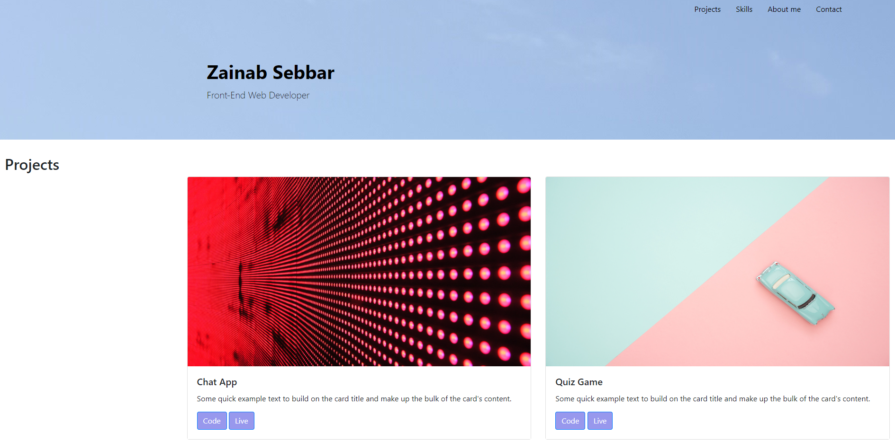

# Challenge-3
Bootstrap-Portfolio

https://zainase7835.github.io/Challenge-3/

## Description:
The aim of this project was to recreate my portfolio from challenge-2 using Bootstrap to save time writing HTML and CSS code.

## Lessons learnt from this project:
-How to use bootstrap to create a template for my webpage
-Edit and customise Bootstrap CSS, by adding my code to an external CSS stylesheet
-Use Bootstrap grid system to organise the layout of my content

## Usage:
The information is layed out in the webpage, the portfolio sections are as follows: 

- Projects
- Skills 
- About me 
- Contact

Scroll down to see the different sections or use the navigation bar to jump to a specific section of the portfolio.

## Installation:
N/A

## Credits:
N/A

## License:
Please refer to the LICENSE in repository
